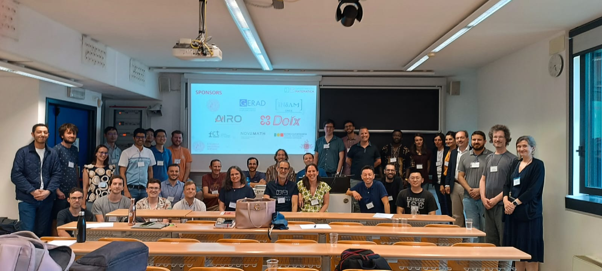

DFOSymposium.github.io
================
Public website for the Derivative-Free Optimization Symposium (DFOS)

DFOS is a community-driven, single-track symposium highlighting the latest international developments in Derivative-free Optimization (DFO) and occuring biennially. The main goal is to find new connections between research focused in DFO algorithmic design and novel applications of DFO. A single-track workshop facilitates the interaction among participants, strengthening possibilities of collaboration. 

Symposia
-----------------------------------------------------------------------------------------------------------------------------------------

DFOS is held biennially:

* **[2nd Derivative-Free Optimization Symposium (DFOS'24)](https://sites.google.com/diag.uniroma1.it/dfos24/home), June 24-28, 2024, Padova, Italy:**

Thanks to the local organizing committee (Giampaolo Liuzzi, Margherita Porcelli, and Francesco Rinaldi) and the scientific committee  (Ana Luísa Custódio, Sebastien Le Digabel, Giampaolo Liuzzi, Margherita Porcelli, and Francesco Rinaldi).
* **[1st Derivative-Free Optimization Symposium (DFOS'22)](https://www.birs.ca/events/2022/5-day-workshops/22w5199), July 17-22, 2022, Kelowna, Canada:**

Thanks to organizers Warren Hare, Charles Audet, Ana Luísa Custódio, and Matt Menickelly.
* **0th Derivative-Free Optimization Symposium (DFOS'20) -- Postponed**

---

Steering Committee
---------------------------------------------------------------------------------------------------------------------------------------------------------------------
The DFOS Steering Committee is responsible for siting future DFOS instantiations, forming scientific committees, and advising on the evolution of the series.

* [Charles Audet](https://www.gerad.ca/Charles.Audet/), Polytechnique Montréal, Canada
* [Ana Luísa Custódio](https://docentes.fct.unl.pt/algb/), NOVA School of Science and Technology, Portugal
* [Francesco Rinaldi](https://sites.google.com/view/francescorinaldi), University of Padova, Italy
* [Katya Scheinberg](https://sites.gatech.edu/katya-scheinberg/), Georgia Tech, USA
* [Stefan M. Wild](https://wildsm.github.io/), Lawrence Berkeley National Laboratory, USA
* [Ya-xiang Yuan](https://lsec.cc.ac.cn/~yyx/), Chinese Academy of Sciences, China
